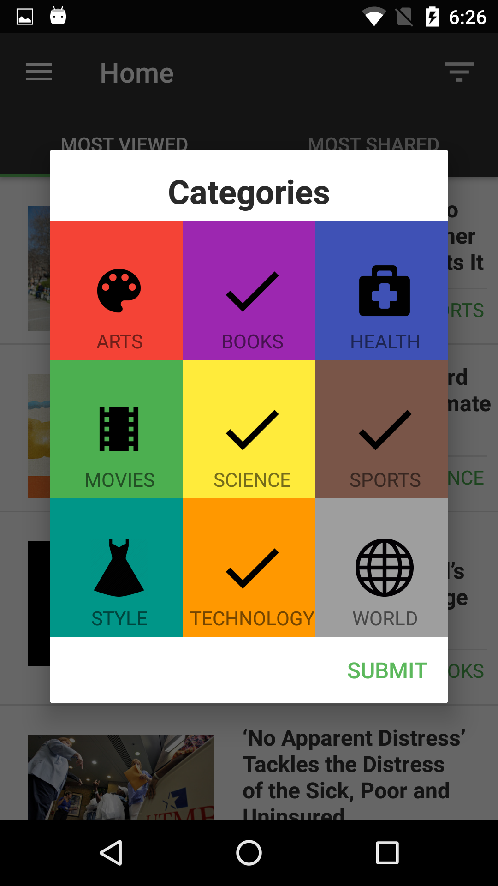

# News4U

Udacity's Android Developer Nanodegree Capstone project (in development).

Display news collected from the NewYorkTimesAPI divided by category.

## Screens

## Libraries:
* [ButterKnife](https://github.com/JakeWharton/butterknife)
* [Retrofit](https://github.com/square/retrofit)
* [GSON](https://github.com/google/gson)
* [Timber](https://github.com/JakeWharton/timber)
* [Picasso](https://github.com/square/picasso)
* [Firebase Realtime Database](https://console.firebase.google.com/)

##How to use:

* Get a [NYT API key](https://developer.nytimes.com/signup) then add your API key to gradle.properties as:
API_KEY = “abcdef”

*Set up your [Firebase Realtime Database](https://console.firebase.google.com/)

I hope you enjoy =).
 
